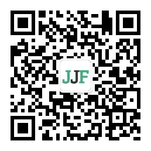

# wx-web3

## Team

* Name: Web3Hacker
* email: Bruce@web3hacker.ninja

## What is it?

这是个 微信服务号内的 `NFT 铸造机及 IPFS 分享器`, 用户只需简单设置三个参数即可在微信服务号内便捷的 `铸造 NFT` 或 `上传文件到 IPFS 存储`。

## How it works?

1. 使用 Pinata 服务来上传文件到 IPFS
2. 使用微信服务号内的数据渠道来方便用户在微信服务号内即可使用 IPFS 及 NFT 铸造服务
3. 简单的 NFT 浏览器

## 代码说明

1. `api/wechat_mp.js`: 微信服务号的逻辑核心代码，提供了所有的功能逻辑
2. `api/userWalletAddress.js`: 提供 api 给 H5 来展示某个钱包地址的 NFT 列表，使用了 NFTPort 的 API，并在数据库层做了缓存优化
3. `api/getData.js`: NFT数据的存储缓存逻辑，5 分钟过期时间
4. `fe/userWalletAddress.vue`: H5 展示用户 NFT 的前端核心代码

## 示范截图: 请查看 [screenshot目录](./screenshot)

## Demo 体验: 微信服务号扫码体验

## Contract

* Twitter: @Web3HackerNinja
* email: Bruce@Web3Hacker.Ninja

加入产品种子用户群：

